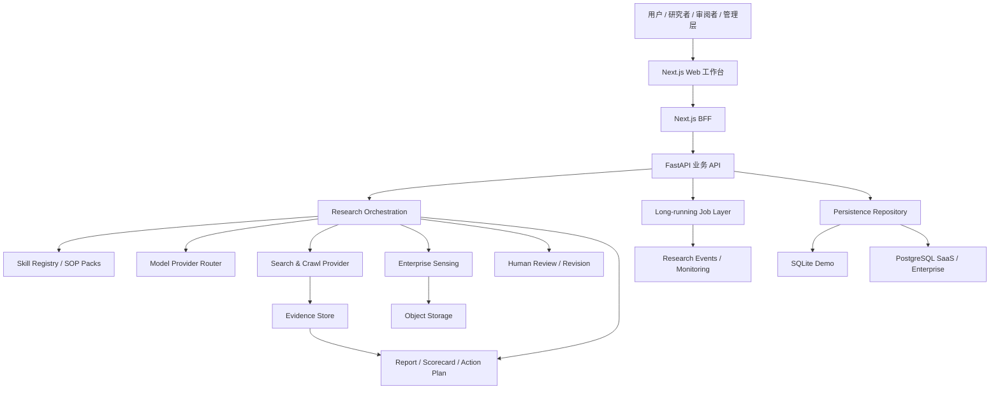

# Trident 系统架构

## 1. Overview

Trident 是面向行业研究、企业增长决策与投资研究的 AI 决策工作台。系统把产品界面、研究方法、Agent 编排、证据治理、长期任务、企业数据与模型供应商解耦，确保同一研究底座可以扩展为不同场景模块。

本文同时记录三种状态：

- **当前实现**：代码库中已经存在并可运行的能力。
- **迁移中**：已经建立接口或部署基线，但仍需完成生产化。
- **规划能力**：产品方向已经明确，但不可对外宣称已经交付。

## 2. Architecture Goals

1. 研究方法与模型解耦：更换模型不重写研究 SOP。
2. 前端与研究执行解耦：网页关闭不应终止长任务。
3. 数据层可迁移：本地 SQLite Demo 可迁往 PostgreSQL、多租户或企业私有库。
4. 场景模块化：PE/VC、企业增长、行业研究共享公共引擎，使用独立 Scenario Pack。
5. 全链路可追溯：输入、证据、判断、人工修改、报告版本和行动计划均可审计。
6. 支持两种研究路径：构建式研究与审阅式研究使用同一份项目数据。
7. 为专业算法团队保留扩展口：算法策略、评估器、事件流、模型路由均通过接口接入。
8. 双区域单产品：Vercel 与 CloudBase 共享研究内核、Web 功能、API、数据契约、Skill
   和发布版本；区域差异限定在部署与基础设施适配层。

## 3. High-level Diagram

## 4. Components

| 组件 | 当前状态 | 职责 |
|---|---|---|
| Next.js Web | 当前实现 | 多页面研究工作台、项目列表、研究路径入口与结果展示 |
| Next.js BFF | 当前实现 | 将浏览器请求转发至 FastAPI，隐藏内部服务地址 |
| FastAPI | 当前实现 | 项目、研究范围、Brief、Plan 与 report-first 等业务接口 |
| Research Services | 当前实现 | 规划、检索、分析、预测、评分、行动计划和报告生成 |
| Skill / SOP Packs | 当前实现并持续扩展 | 固化行业定义、产业链、市场规模、竞争格局、驱动因素等研究方法 |
| Model Provider | 当前实现 | 调用兼容 OpenAI 协议的模型服务，并保留更换供应商能力 |
| Search Provider | 当前实现 | REST/MCP 搜索与网页抓取，形成证据素材 |
| Persistence Repository | 当前实现 | 以统一接口支持 SQLite、PostgreSQL/MySQL 连接模式 |
| Long-running Job Layer | 迁移中 | 使报告生成与网页生命周期解耦；Demo 可单 Worker，规模化使用 Celery/Temporal |
| Memory Layer | 部分实现 | 项目快照与历史版本已有基础；企业时间化记忆和知识图谱为后续能力 |
| Continuous Sensing | 规划能力 | 定期抓取政策、公司、竞争者、客户与宏观信号并触发影响分析 |
| Multi-role Workspace | 规划能力 | 投资经理、研究负责人、管理层等不同权限与工作台 |

## 5. Technology Stack

| 层级 | 当前技术 | 演进方向 |
|---|---|---|
| Web | Next.js 16、React 19、TypeScript | 企业门户组件、插件式嵌入、微前端或 SDK |
| API | Python 3.12、FastAPI、Pydantic | API Gateway、服务拆分、企业连接器 |
| 研究执行 | Python service layer、provider adapters | Celery/Redis；规模化后 Temporal |
| 数据库 | SQLite Demo；SQLAlchemy repository | PostgreSQL、RLS、多租户、备份与读写分离 |
| 文件 | 当前由应用处理上传与提取 | 对象存储、病毒扫描、生命周期策略、加密 |
| 模型 | 外部大模型 API | 多模型路由、成本/质量策略、企业自带模型 |
| 搜索 | AgentHub REST/MCP | 持续感知、专业数据库、企业内外联合检索 |
| 部署 | Vercel 海外前端；CloudBase 中国 Demo 基线 | 标准 SaaS、VPC、私有云、Kubernetes |

## 6. Data Flow

1. 用户建立项目并提交行业、地区、研究目标和可选企业战略意图。
2. Prompt Analysis 将原始需求拆解为结构化范围、问题和验收条件。
3. Gate 0 由用户确认或修订市场口径。
4. Research Planner 依据 SOP 生成任务与搜索问题。
5. Search Provider 搜索和抓取，Evidence Engine 提取陈述、来源与适用范围。
6. 研究服务生成行业分析、未来趋势、情景与反证。
7. 企业战略项目将已批准企业信息映射为 Scorecard 与战略差距。
8. Action Planning 根据市场趋势、公司差距和战略目标形成短期/长期行动。
9. Report Generation 组合成网页、Word 和 PDF，并保留引用与版本记录。
10. 审阅式研究仅更新选中的模块，其他已确认模块和人工修改保持不变。

## 7. Integration Points

- **模型**：通过 provider adapter 与环境变量切换 Base URL、模型名和凭证。
- **搜索**：REST 或 MCP；未来可加入政策库、招股书、专业行业数据库。
- **企业系统**：先文件上传，再通过只读 API 接入 CRM、ERP、数据仓库等。
- **场景模块**：通过 `ScenarioPack`、`IndustryPack`、`AlgorithmStrategy` 等接口装载。
- **外部工作流**：FastAPI 可被门户、插件、企业内部 Agent 或自动化平台调用。

## 8. Deployment Topology

- **共同应用层**：以下拓扑均从同一仓库和发布版本构建，调用同一 Research Services，
  不允许维护大陆/海外两套研究流程或前端功能分支。
- **海外 Demo**：Vercel 承载 Next.js；后端与数据库独立托管。
- **中国大陆 Demo**：CloudBase 云托管运行统一容器，SQLite 单实例过渡；不得多副本写同一 SQLite 文件。
- **标准 SaaS**：Web、API、Worker、Redis、PostgreSQL、对象存储分别部署。
- **企业部署**：VPC/私有云/Kubernetes，连接企业身份、密钥管理和日志平台。

## 9. Scalability

- API 保持无状态，项目状态写入数据库。
- 长任务必须具有幂等键、状态机、重试和断点续跑能力。
- 文件存入对象存储，数据库仅保存元数据与解析结果。
- 模型与搜索调用设置限流、缓存、熔断、预算和供应商切换。
- 事件模型用于异步更新项目进度、审计和实时通知。

## 10. Constraints

- 区域差异必须位于配置、Provider Adapter 或部署清单；禁止在领域服务中使用地区条件
  分叉研究逻辑。确有合规差异时，应在统一合同下实现可审计策略，而不是复制流程。
- 当前 CloudBase SQLite 仅适合融资 Demo 和低并发单实例。
- 当前 API 覆盖核心项目流程，但尚非完整企业级 API 网关。
- 300MB 文件支持要求平台、反向代理、应用和对象存储同时放宽限制。
- 外部模型和搜索服务的可用性、成本与地域访问会影响生成任务。
- 报告质量不能只依赖模型输出，必须经过结构校验与人工审阅机制。

## 11. Future Evolution

1. 完成持久化 PostgreSQL 和数据库迁移脚本。
2. 引入异步任务、事件流和任务监控。
3. 建立 Profile、Benchmark & Case、Simulation、Adaptive Planning 和 Memory Engine。
4. 加入 PE/VC 与企业增长 Scenario Packs。
5. 建立持续感知订阅与影响分析。
6. 实现多租户、RBAC/RLS、SSO、审计与企业连接器。
7. 建立离线与在线评估闭环，使算法团队可以安全迭代策略而不破坏研究主流程。
